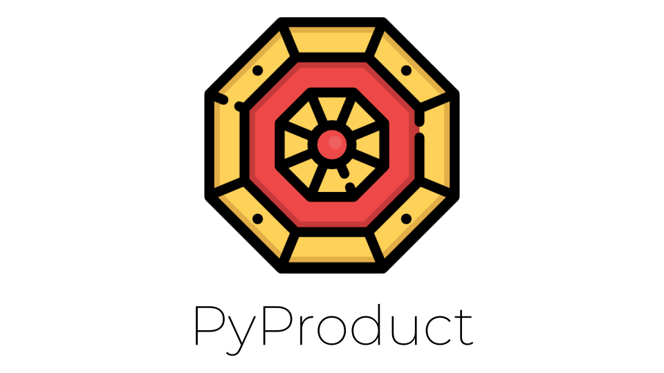

<p align="center"></p>

<p align="center">
    <a href="https://github.com/elginbeloy/PyProduct/blob/master/LICENSE">
        
    </a>
</p>


PyProduct is a Python + Selenium + BeautifulSoup based web catalog scraper, programmatic OMS, and all-around e-commerce interaction bot solution.

# What is PyProduct

In short, PyProduct aims to be the one-stop shop for e-commerce interaction, from catalog scraping, to programmatic OMS and inventory tracking. PyProduct is built with Python, Selenium, and BeautifulSoup. PyProduct allows for quick and efficient data capture from online e-commerce catalogs like Nike, Adidas, and others using headless browser bot interactions.

The goals of PyProduct are as follows:
- Integration free, clone-and-go setup
- Efficient online e-commerce catalog data capture
- Secure and fast oms order placement
- Reliable inventory and shipping option tracking

# Getting Started

To get started with PyProduct, simply clone, install dependencies, get a driver, and go:

1. Clone the repo and cd into the directory

```
git clone https://github.com/elginbeloy/PyProduct
cd PyProduct
```

2. Install requirements.txt into a virtual environment of your choice

```
virtualenv venv
source ./venv/bin/activate
pip install -r requirements.txt
```

3. Download a chrome driver [here](https://chromedriver.chromium.org/downloads), and place it in the PyProduct directory as `chromedriver`

4. Run PyProduct with help to see options 

```
python pyproduct.py --help
```

# ToDo's

[x] - Add `README.md` getting started and explanation documentation
[ ] - Make crawler not include detail URLs (catalog list URLs only)
[ ] - Add smooth scrolling for lazy-loaded product images, etc...
[ ] - Make results a unique set to ensure no repeat products

[ ] - Add MSRP to scraped data
[ ] - Support multiple images in scraped data
[ ] - Add origin purchase URL to scraped data 
[ ] - Add availability to scraped data
[ ] - Add shipping options to scraped data

[ ] - Standardize and expand programmatic OMS
[ ] - Intergrate scraper with programmatic OMS System

[ ] - Add testing, code coverage, and badges for each to README.md

[ ] - Add automatic cached xpath and url generation
[ ] - Make cached xpath test to ensure UI not updated (if so regenerate or alert)
[ ] - Make NN based xpath generation using NLP or CNN
[ ] - Create system for scraping products on an interval and saving to PostgreSQL

# Contributing

Don't for now 🤷 Gotta get it to a good starting place first.
